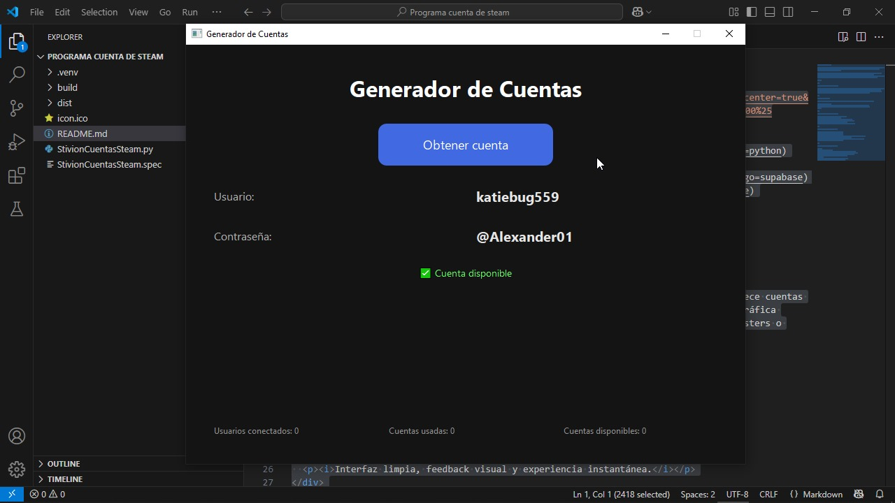

<div align="center">


</div>

---

## 🎯 Descripción del Proyecto

**Steam Account Giver** es una aplicación de escritorio construida en Python que ofrece cuentas de Steam aleatorias desde una base de datos en Supabase. Diseñada con una interfaz gráfica ultra limpia, animaciones suaves y un estilo profesional, pensada para creadores, testers o comunidades que desean distribuir accesos de forma controlada y automática.

---

## 🖼️ Demo Visual

> Reemplaza el GIF con tu grabación. Si lo tienes listo, puedo integrarlo por ti.

<div align="center">
  
  <p><i>Interfaz limpia, feedback visual y experiencia instantánea.</i></p>
</div>

---

## ⚙️ Características Técnicas

- 🔀 **Cuentas aleatorias** desde Supabase
- ✅ **Estado en vivo**: usada o no
- 🔄 **Contador en tiempo real** de cuentas usadas
- 💎 **Animaciones suaves** al mostrar info y botones
- 🖥️ **Modo oscuro / Fullscreen opcional**
- 🧩 **Empaquetado en `.exe`** con icono personalizado

---

## 🛠️ Tecnologías Utilizadas

| Componente | Librería/Herramienta |
|------------|----------------------|
| Lenguaje   | Python 3.10+         |
| GUI        | [Dear PyGui](https://github.com/hoffstadt/DearPyGui) |
| Backend    | [Supabase](https://supabase.com) |
| Animaciones | `DearPyGui` (hover, fade) + transiciones visuales |
| Distribución | PyInstaller `.exe` |

---

## 📁 Estructura del Proyecto

```bash
📦 Steam Account Giver
├── app.py                 # Interfaz gráfica principal


├── icono.ico             # Ícono de la app
 app.exe           # Ejecutable final
